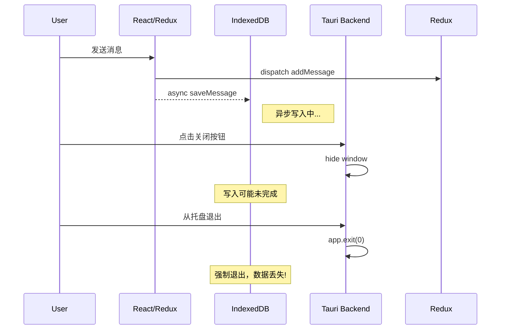
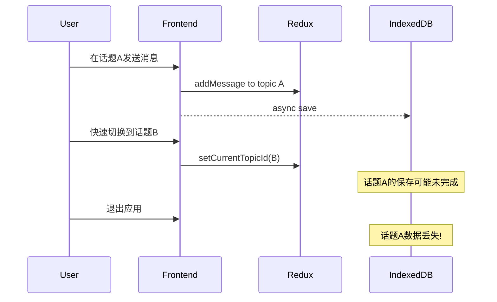

# AetherLink 数据丢失问题深度分析报告

## 一、问题概述

用户报告了以下严重问题：
1. **话题数据丢失**：退出应用后重新启动，最近一个话题的所有消息数据丢失，变成空话题
2. **Windows端Bug频发**：文件无法粘贴、对话连接失败等问题
3. **跨平台问题**：Android端和Windows端都会出现数据丢失

## 二、根本原因分析

### 2.1 数据存储架构问题

通过代码分析，发现项目存在**双重存储**设计缺陷：

```typescript
// src/shared/database/config.ts
topics: {
  key: string;
  value: ChatTopic & { messages: Message[] }; // 话题表同时存储messages数组
  // ...
};

messages: {
  key: string;
  value: Message; // 独立的messages表
  // ...
};
```

**问题**：消息同时存储在两个地方：
1. `topics` 表中的 `messages` 数组（已废弃但仍在使用）
2. 独立的 `messages` 表（新架构）

### 2.2 数据同步不一致

在 [`DexieStorageService.saveMessage()`](src/shared/services/storage/DexieStorageService.ts:868) 中：

```typescript
async saveMessage(message: Message): Promise<void> {
  await this.transaction('rw', [this.topics, this.messages, this.message_blocks], async () => {
    // 1. 保存到 messages 表
    await this.messages.put(message);

    // 2. 更新 topics 表中的 messages 数组（兼容）
    const topic = await this.topics.get(message.topicId);
    if (topic) {
      if (!topic.messages) topic.messages = [];
      // ... 更新 topic.messages
      
      // 3. 同步更新 messageIds 数组
      if (!topic.messageIds.includes(message.id)) {
        topic.messageIds.push(message.id);
      }
      
      await this.topics.put(topic);  // ⚠️ 这里可能失败
    }
  });
}
```

**核心问题**：
- 事务中的任何步骤失败都可能导致部分数据丢失
- `topic.messages` 和 `topic.messageIds` 同时维护，容易不同步

### 2.3 Windows端退出处理问题

查看 [`lib.rs`](src-tauri/src/lib.rs:28-35)：

```rust
#[cfg(target_os = "windows")]
let builder = builder.on_window_event(|window, event| {
  if let tauri::WindowEvent::CloseRequested { api, .. } = event {
    api.prevent_close();    // 阻止关闭
    let _ = window.hide();  // 隐藏到托盘
  }
});
```

**严重问题**：
1. **没有数据保存逻辑**：关闭窗口时只是隐藏，没有触发数据持久化
2. **没有优雅退出处理**：真正退出时（从托盘退出）没有确保数据已保存
3. **IndexedDB 写入是异步的**：如果应用在写入完成前被强制关闭，数据会丢失

### 2.4 消息加载与保存时机问题

在 [`newMessagesSlice.ts`](src/shared/store/slices/newMessagesSlice.ts:500-570) 的 `loadTopicMessages` thunk 中：

```typescript
export const loadTopicMessages = createAsyncThunk(
  'messages/loadTopicMessages',
  async (topicId: string, { dispatch, getState }) => {
    // 检查是否已加载
    const existingMessageIds = state.messages.messageIdsByTopic[topicId] || [];
    const hasActualMessages = existingMessageIds.length > 0 && ...;
    
    if (hasActualMessages && isTopicFulfilled) {
      return; // ⚠️ 跳过加载，但如果数据库中有更新的数据会丢失
    }
    
    // 从数据库加载
    if (topic.messageIds && topic.messageIds.length > 0) {
      messagesFromTopic = await dexieStorage.getMessagesByIds(topic.messageIds);
    }
  }
);
```

**问题**：
- Redux 状态和数据库状态不同步
- 缓存策略可能导致最新数据不被加载

### 2.5 数据库迁移遗留问题

从 [`database/migrations/index.ts`](src/shared/database/migrations/index.ts:124-177) 可以看到经历了多次迁移：

- **版本4**：消息从 `topics.messages` 迁移到独立 `messages` 表
- **版本5**：消息又从 `messages` 表迁移回 `topics.messages`
- **版本6-8**：添加新表但保留了双重存储结构

这种来回迁移造成了：
1. 部分数据可能在迁移过程中丢失
2. 新旧代码混用，数据一致性难以保证

## 三、数据丢失场景重现

### 场景1：正常退出数据丢失



### 场景2：快速切换话题数据丢失



### 场景3：messageIds 和 messages 不同步

```
topic = {
  id: "topic-1",
  messageIds: ["msg-1", "msg-2", "msg-3"],  // 引用3条消息
  messages: [msg1, msg2]  // 但实际只有2条消息对象
}

// 加载时使用 messageIds，但数据来源于 messages 数组
// 结果：msg-3 丢失
```

## 四、修复方案

### 4.1 紧急修复：添加退出前数据持久化

**前端：监听窗口关闭事件**

```typescript
// src/shared/hooks/useDataPersistence.ts
import { listen } from '@tauri-apps/api/event';
import { dexieStorage } from '../services/storage/DexieStorageService';

export const useDataPersistence = () => {
  useEffect(() => {
    // 监听应用退出前事件
    const unlisten = listen('app-closing', async () => {
      console.log('[DataPersistence] 应用即将关闭，确保数据保存...');
      await flushAllPendingWrites();
    });
    
    // 监听页面 beforeunload
    const handleBeforeUnload = (e: BeforeUnloadEvent) => {
      // 触发同步保存
      flushAllPendingWritesSync();
      e.preventDefault();
    };
    
    window.addEventListener('beforeunload', handleBeforeUnload);
    
    return () => {
      unlisten.then(fn => fn());
      window.removeEventListener('beforeunload', handleBeforeUnload);
    };
  }, []);
};

async function flushAllPendingWrites() {
  // 1. 获取当前话题
  const state = store.getState();
  const currentTopicId = state.messages.currentTopicId;
  
  if (currentTopicId) {
    // 2. 确保当前话题的所有消息都已保存
    const messages = selectMessagesByTopicId(state, currentTopicId);
    
    for (const message of messages) {
      await dexieStorage.saveMessage(message);
    }
    
    // 3. 确保话题的 messageIds 正确
    const topic = await dexieStorage.getTopic(currentTopicId);
    if (topic) {
      topic.messageIds = messages.map(m => m.id);
      await dexieStorage.saveTopic(topic);
    }
  }
  
  console.log('[DataPersistence] 数据保存完成');
}
```

**后端：发送退出事件**

```rust
// src-tauri/src/lib.rs
#[cfg(target_os = "windows")]
let builder = builder.on_window_event(|window, event| {
  match event {
    tauri::WindowEvent::CloseRequested { api, .. } => {
      api.prevent_close();
      let _ = window.hide();
    }
    _ => {}
  }
});

// 修改托盘退出逻辑
.on_menu_event(|app, event| match event.id.as_ref() {
  "quit" => {
    // 先发送事件通知前端保存数据
    if let Some(window) = app.get_webview_window("main") {
      let _ = window.emit("app-closing", ());
      // 等待一小段时间让前端完成保存
      std::thread::sleep(std::time::Duration::from_millis(500));
    }
    app.exit(0);
  }
  // ...
})
```

### 4.2 统一数据存储架构

**移除双重存储，只使用 messageIds 引用方式：**

```typescript
// src/shared/services/storage/DexieStorageService.ts

async saveTopic(topic: ChatTopic): Promise<void> {
  // ❌ 移除旧的兼容代码
  // if (topic.messages && Array.isArray(topic.messages)) { ... }
  
  // ✅ 只保存 messageIds 引用
  const topicToStore = {
    ...topic,
    _lastMessageTimeNum: new Date(topic.lastMessageTime || new Date()).getTime()
  };
  
  // 确保不存储 messages 数组
  delete (topicToStore as any).messages;
  
  await this.topics.put(topicToStore);
}

async saveMessage(message: Message): Promise<void> {
  await this.transaction('rw', [this.topics, this.messages], async () => {
    // 1. 只保存到 messages 表
    await this.messages.put(message);
    
    // 2. 只更新 topic.messageIds
    const topic = await this.topics.get(message.topicId);
    if (topic) {
      if (!topic.messageIds) topic.messageIds = [];
      if (!topic.messageIds.includes(message.id)) {
        topic.messageIds.push(message.id);
      }
      // ❌ 不再更新 topic.messages
      await this.topics.put(topic);
    }
  });
}
```

### 4.3 添加数据完整性检查

```typescript
// src/shared/services/DataIntegrityService.ts

export class DataIntegrityService {
  /**
   * 检查并修复话题数据完整性
   */
  static async verifyAndRepairTopic(topicId: string): Promise<{
    hasIssues: boolean;
    repaired: boolean;
    details: string[];
  }> {
    const details: string[] = [];
    let hasIssues = false;
    
    const topic = await dexieStorage.getTopic(topicId);
    if (!topic) {
      return { hasIssues: true, repaired: false, details: ['话题不存在'] };
    }
    
    // 1. 检查 messageIds 引用的消息是否都存在
    const missingMessageIds: string[] = [];
    for (const messageId of topic.messageIds || []) {
      const message = await dexieStorage.getMessage(messageId);
      if (!message) {
        missingMessageIds.push(messageId);
        hasIssues = true;
      }
    }
    
    if (missingMessageIds.length > 0) {
      details.push(`发现 ${missingMessageIds.length} 个消息引用丢失`);
      // 移除无效引用
      topic.messageIds = (topic.messageIds || []).filter(
        id => !missingMessageIds.includes(id)
      );
      await dexieStorage.saveTopic(topic);
      details.push('已修复无效消息引用');
    }
    
    // 2. 检查是否有孤立的消息（在 messages 表中但不在 messageIds 中）
    const allMessages = await dexieStorage.getMessagesByTopicId(topicId);
    const orphanMessages = allMessages.filter(
      msg => !(topic.messageIds || []).includes(msg.id)
    );
    
    if (orphanMessages.length > 0) {
      details.push(`发现 ${orphanMessages.length} 个孤立消息`);
      hasIssues = true;
      
      // 将孤立消息添加回 messageIds
      topic.messageIds = [...(topic.messageIds || []), ...orphanMessages.map(m => m.id)];
      // 按时间排序
      const sortedMessages = await dexieStorage.getMessagesByIds(topic.messageIds);
      sortedMessages.sort((a, b) => 
        new Date(a.createdAt).getTime() - new Date(b.createdAt).getTime()
      );
      topic.messageIds = sortedMessages.map(m => m.id);
      
      await dexieStorage.saveTopic(topic);
      details.push('已修复孤立消息');
    }
    
    return {
      hasIssues,
      repaired: hasIssues,
      details
    };
  }
  
  /**
   * 应用启动时进行数据完整性检查
   */
  static async performStartupCheck(): Promise<void> {
    console.log('[DataIntegrity] 开始启动检查...');
    
    const topics = await dexieStorage.getAllTopics();
    let repairedCount = 0;
    
    for (const topic of topics) {
      const result = await this.verifyAndRepairTopic(topic.id);
      if (result.repaired) {
        repairedCount++;
        console.log(`[DataIntegrity] 修复话题 ${topic.id}:`, result.details);
      }
    }
    
    console.log(`[DataIntegrity] 检查完成，修复了 ${repairedCount} 个话题`);
  }
}
```

### 4.4 修复 Windows 端粘贴问题

检查并修复 Tauri 的剪贴板权限和处理：

```typescript
// src/shared/services/TauriClipboardService.ts

import { readText, writeText, readImage } from '@tauri-apps/plugin-clipboard-manager';

export class TauriClipboardService {
  static async readClipboard(): Promise<{ text?: string; hasImage: boolean }> {
    try {
      // 尝试读取文本
      const text = await readText();
      
      // 尝试读取图片
      let hasImage = false;
      try {
        const imageData = await readImage();
        hasImage = !!imageData;
      } catch {
        // 没有图片数据
      }
      
      return { text, hasImage };
    } catch (error) {
      console.error('[TauriClipboard] 读取剪贴板失败:', error);
      throw error;
    }
  }
  
  static async writeToClipboard(text: string): Promise<void> {
    try {
      await writeText(text);
    } catch (error) {
      console.error('[TauriClipboard] 写入剪贴板失败:', error);
      throw error;
    }
  }
}
```

## 五、实施优先级

| 优先级 | 任务 | 影响范围 | 复杂度 |
|-------|------|---------|-------|
| P0 | 添加退出前数据保存机制 | 所有平台 | 中 |
| P0 | 统一数据存储架构，移除双重存储 | 核心 | 高 |
| P1 | 添加启动时数据完整性检查 | 所有平台 | 中 |
| P1 | 修复 Windows 端粘贴功能 | Windows | 低 |
| P2 | 添加数据保存失败的用户提示 | UX | 低 |
| P2 | 添加数据备份和恢复功能 | 安全性 | 中 |

## 六、测试方案

### 6.1 数据丢失测试

```
1. 发送多条消息
2. 立即关闭应用（不等待）
3. 重新打开应用
4. 验证所有消息是否存在
```

### 6.2 快速操作测试

```
1. 快速发送多条消息（连续点击）
2. 快速切换话题
3. 关闭并重新打开应用
4. 验证所有话题的消息是否完整
```

### 6.3 压力测试

```
1. 创建 10+ 个话题
2. 每个话题发送 50+ 条消息
3. 随机切换话题并发送消息
4. 关闭应用
5. 验证所有数据完整性
```

## 七、长期改进建议

1. **引入 Write-Ahead Logging (WAL)**：在写入 IndexedDB 前先写入日志，确保可恢复
2. **添加数据版本控制**：每次修改记录版本，支持数据回滚
3. **实现自动备份**：定期将数据备份到文件系统
4. **添加数据同步状态指示器**：让用户知道数据是否已保存
5. **考虑使用 SQLite**：Tauri 支持 SQLite，比 IndexedDB 更可靠