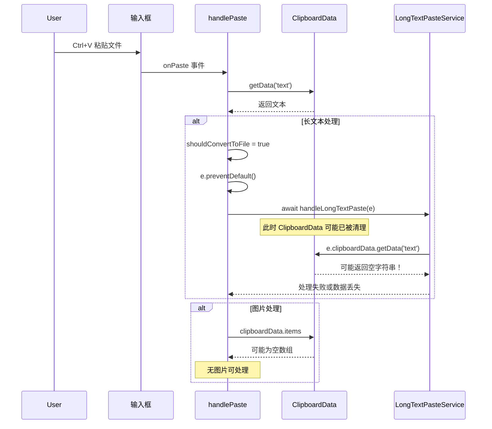

# Windows端文件无法粘贴问题深度分析

## 一、问题现象

用户报告在 Windows 端：
- 文件无法粘贴到聊天输入框
- 图片粘贴可能失败
- 长文本粘贴转文件功能不工作

## 二、根本原因分析

### 2.1 Tauri v2 缺少剪贴板插件

查看 [`Cargo.toml`](src-tauri/Cargo.toml:27-34)，当前项目使用的插件：

```toml
tauri-plugin-http = { version = "2.5", features = ["socks"] }
tauri-plugin-dialog = "2"
tauri-plugin-fs = "2"
tauri-plugin-shell = "2"
# ❌ 缺少 tauri-plugin-clipboard-manager
```

**问题**：项目完全依赖 Web API `navigator.clipboard`，但在 Tauri WebView (Windows) 中，这个 API 可能受到安全策略限制。

### 2.2 剪贴板访问实现问题

在 [`PlatformAdapter.ts`](src/shared/adapters/PlatformAdapter.ts:501-513) 中，Tauri 端的剪贴板实现：

```typescript
// TauriAdapter
clipboard = {
  async writeText(text: string): Promise<void> {
    // 仅使用 Web API，没有 fallback
    if (navigator.clipboard) {
      await navigator.clipboard.writeText(text);
    }
    // ⚠️ 如果 navigator.clipboard 不可用，静默失败
  },

  async readText(): Promise<string> {
    if (navigator.clipboard) {
      return await navigator.clipboard.readText();
    }
    return '';  // ⚠️ 静默返回空字符串
  },
};
```

**问题**：
1. 没有使用 Tauri 原生剪贴板插件
2. Web API 可能被 Windows 安全策略阻止
3. 错误时静默失败，用户无感知

### 2.3 ClipboardEvent 异步失效问题

在 [`FileUploadManager.tsx`](src/components/input/ChatInput/FileUploadManager.tsx:249-320) 中：

```typescript
const handlePaste = async (e: React.ClipboardEvent) => {
  const clipboardData = e.clipboardData;
  if (!clipboardData) return;

  const textData = clipboardData.getData('text');  // ✅ 同步操作
  
  if (textData && shouldConvertToFile(textData)) {
    e.preventDefault();
    setUploadingMedia(true);
    try {
      await handleLongTextPaste(e);  // ⚠️ 异步操作！
      // 在 handleLongTextPaste 内部再次访问 e.clipboardData 可能失败
    } finally {
      setUploadingMedia(false);
    }
    return;
  }

  // 处理图片粘贴
  const items = Array.from(clipboardData.items);
  const imageItems = items.filter(item => item.type.startsWith('image/'));
  // ⚠️ 如果上面的异步操作导致 clipboardData 失效，这里可能为空
};
```

**问题**：
- `ClipboardEvent.clipboardData` 是一个临时对象
- 在事件处理函数返回后，浏览器可能会清理这个对象
- 如果有任何 `await` 操作，后续访问可能得到空数据

### 2.4 长文本转文件服务的目录问题

在 [`LongTextPasteService.ts`](src/shared/services/LongTextPasteService.ts:192-218) 中：

```typescript
private async saveFileForTauri(fileRecord: FileType, textContent: string): Promise<void> {
  try {
    const globalObj = globalThis as any;
    if (globalObj.__TAURI__?.fs || globalObj.__TAURI_INTERNALS__) {
      try {
        const { writeTextFile, BaseDirectory } = await import('@tauri-apps/plugin-fs');
        const filePath = `AetherLink/files/${fileRecord.name}`;
        // ⚠️ 问题：目录可能不存在！
        await writeTextFile(filePath, textContent, {
          baseDir: BaseDirectory.AppData
        });
        fileRecord.path = filePath;
      } catch (tauriError) {
        // 静默降级到 Dexie
        console.warn('[LongTextPasteService] Tauri v2 API 不可用，使用 Dexie 存储');
        await this.saveFileForWeb(fileRecord);
      }
    }
  } catch (error) {
    await this.saveFileForWeb(fileRecord);
  }
}
```

**问题**：
1. 没有先创建 `AetherLink/files/` 目录
2. `writeTextFile` 在目录不存在时会失败
3. 错误被静默处理，用户不知道文件去了哪里

### 2.5 Windows WebView2 剪贴板安全限制

Windows 上的 Tauri 使用 WebView2 (Edge 内核)，可能存在以下限制：

1. **HTTPS 上下文要求**：某些浏览器要求页面在安全上下文(HTTPS)中才能使用剪贴板 API
2. **用户交互要求**：某些剪贴板操作必须由用户直接触发（如点击按钮）
3. **权限策略**：`Permissions-Policy` 可能阻止剪贴板访问
4. **焦点要求**：窗口可能需要处于焦点状态才能访问剪贴板

## 三、问题复现流程



## 四、修复方案

### 4.1 紧急修复：在异步操作前保存剪贴板数据

```typescript
// src/components/input/ChatInput/FileUploadManager.tsx

const handlePaste = async (e: React.ClipboardEvent) => {
  const clipboardData = e.clipboardData;
  if (!clipboardData) return;

  // ✅ 立即同步获取所有需要的数据
  const textData = clipboardData.getData('text');
  const htmlData = clipboardData.getData('text/html');
  
  // ✅ 立即克隆图片数据
  const items = Array.from(clipboardData.items);
  const imageFiles: File[] = [];
  for (const item of items) {
    if (item.type.startsWith('image/')) {
      const file = item.getAsFile();
      if (file) imageFiles.push(file);
    }
  }

  // 现在可以安全地进行异步操作
  if (textData && shouldConvertToFile(textData)) {
    e.preventDefault();
    setUploadingMedia(true);
    try {
      // ✅ 直接传递文本数据，而不是传递事件对象
      await handleLongTextPasteWithText(textData);
    } finally {
      setUploadingMedia(false);
    }
    return;
  }

  if (imageFiles.length > 0) {
    e.preventDefault();
    await processImageFiles(imageFiles);
    return;
  }
};

// 新增：直接处理文本的方法
const handleLongTextPasteWithText = async (text: string) => {
  const result = await longTextPasteService.handleTextPaste(text, {
    enabled: pasteLongTextAsFile,
    threshold: pasteLongTextThreshold
  });
  
  if (result.success && result.convertedToFile && result.file) {
    onFileAdd?.(result.file);
    onSuccess?.(`长文本已转换为文件: ${result.file.name}`);
  }
};
```

### 4.2 添加 Tauri 剪贴板插件

**1. 安装插件**

```bash
cd src-tauri
cargo add tauri-plugin-clipboard-manager
```

**2. 更新 Cargo.toml**

```toml
[dependencies]
# ... 其他依赖
tauri-plugin-clipboard-manager = "2"
```

**3. 在 lib.rs 中注册插件**

```rust
pub fn run() {
  let builder = tauri::Builder::default()
    .plugin(tauri_plugin_http::init())
    .plugin(tauri_plugin_dialog::init())
    .plugin(tauri_plugin_fs::init())
    .plugin(tauri_plugin_shell::init())
    .plugin(tauri_plugin_clipboard_manager::init());  // 添加剪贴板插件
  
  // ... 其余代码
}
```

**4. 前端使用原生剪贴板 API**

```typescript
// src/shared/services/TauriClipboardService.ts

import { 
  readText, 
  writeText, 
  readImage, 
  writeImage 
} from '@tauri-apps/plugin-clipboard-manager';

export class TauriClipboardService {
  /**
   * 读取剪贴板文本
   */
  static async readText(): Promise<string> {
    try {
      return await readText();
    } catch (error) {
      console.error('[TauriClipboard] 读取文本失败:', error);
      // 降级到 Web API
      if (navigator.clipboard?.readText) {
        return await navigator.clipboard.readText();
      }
      throw error;
    }
  }

  /**
   * 写入文本到剪贴板
   */
  static async writeText(text: string): Promise<void> {
    try {
      await writeText(text);
    } catch (error) {
      console.error('[TauriClipboard] 写入文本失败:', error);
      // 降级到 Web API
      if (navigator.clipboard?.writeText) {
        await navigator.clipboard.writeText(text);
        return;
      }
      throw error;
    }
  }

  /**
   * 读取剪贴板图片
   */
  static async readImage(): Promise<Uint8Array | null> {
    try {
      const imageData = await readImage();
      return imageData?.rgba || null;
    } catch (error) {
      console.error('[TauriClipboard] 读取图片失败:', error);
      return null;
    }
  }

  /**
   * 检查剪贴板是否有内容
   */
  static async hasContent(): Promise<{ hasText: boolean; hasImage: boolean }> {
    let hasText = false;
    let hasImage = false;
    
    try {
      const text = await readText();
      hasText = !!text && text.trim().length > 0;
    } catch {}
    
    try {
      const image = await readImage();
      hasImage = !!image;
    } catch {}
    
    return { hasText, hasImage };
  }
}
```

### 4.3 修复长文本转文件的目录问题

```typescript
// src/shared/services/LongTextPasteService.ts

private async saveFileForTauri(fileRecord: FileType, textContent: string): Promise<void> {
  try {
    const { writeTextFile, mkdir, BaseDirectory } = await import('@tauri-apps/plugin-fs');
    const dirPath = 'AetherLink/files';
    const filePath = `${dirPath}/${fileRecord.name}`;
    
    // ✅ 确保目录存在
    try {
      await mkdir(dirPath, {
        baseDir: BaseDirectory.AppData,
        recursive: true  // 递归创建
      });
    } catch (mkdirError) {
      // 目录可能已存在，忽略错误
      console.log('[LongTextPasteService] 目录已存在或创建失败:', mkdirError);
    }
    
    // 写入文件
    await writeTextFile(filePath, textContent, {
      baseDir: BaseDirectory.AppData
    });
    
    fileRecord.path = filePath;
    console.log('[LongTextPasteService] Tauri 文件保存成功:', filePath);
    
  } catch (error) {
    console.error('[LongTextPasteService] Tauri 保存失败:', error);
    // 提供用户反馈
    throw new Error(`文件保存失败: ${error instanceof Error ? error.message : '未知错误'}`);
  }
}
```

### 4.4 更新 PlatformAdapter 使用原生剪贴板

```typescript
// src/shared/adapters/PlatformAdapter.ts

class TauriAdapter implements IPlatformAdapter {
  // ... 其他代码

  clipboard = {
    async writeText(text: string): Promise<void> {
      try {
        // 优先使用 Tauri 原生插件
        const { writeText } = await import('@tauri-apps/plugin-clipboard-manager');
        await writeText(text);
      } catch (error) {
        console.warn('[TauriAdapter] Tauri 剪贴板写入失败，尝试 Web API:', error);
        // 降级到 Web API
        if (navigator.clipboard?.writeText) {
          await navigator.clipboard.writeText(text);
        } else {
          throw new Error('剪贴板不可用');
        }
      }
    },

    async readText(): Promise<string> {
      try {
        // 优先使用 Tauri 原生插件
        const { readText } = await import('@tauri-apps/plugin-clipboard-manager');
        return await readText();
      } catch (error) {
        console.warn('[TauriAdapter] Tauri 剪贴板读取失败，尝试 Web API:', error);
        // 降级到 Web API
        if (navigator.clipboard?.readText) {
          return await navigator.clipboard.readText();
        }
        throw new Error('剪贴板不可用');
      }
    },
  };
}
```

### 4.5 添加错误提示和用户反馈

```typescript
// src/components/input/ChatInput/FileUploadManager.tsx

const handlePaste = async (e: React.ClipboardEvent) => {
  try {
    const clipboardData = e.clipboardData;
    
    // 检查剪贴板是否可用
    if (!clipboardData) {
      toastManager.show({
        message: '无法访问剪贴板，请检查浏览器权限',
        type: 'error',
        duration: 3000
      });
      return;
    }

    // ... 处理逻辑

  } catch (error) {
    console.error('[FileUploadManager] 粘贴处理失败:', error);
    toastManager.show({
      message: `粘贴失败: ${error instanceof Error ? error.message : '未知错误'}`,
      type: 'error',
      duration: 5000
    });
  }
};
```

## 五、实施优先级

| 优先级 | 任务 | 复杂度 | 影响范围 |
|-------|------|-------|---------|
| **P0** | 修复异步时序问题（提前保存剪贴板数据） | 低 | 所有平台 |
| **P0** | 添加 tauri-plugin-clipboard-manager | 中 | Windows |
| **P1** | 修复目录创建问题 | 低 | Windows |
| **P1** | 更新 PlatformAdapter 使用原生 API | 中 | Windows |
| **P2** | 添加详细错误提示 | 低 | UX |

## 六、测试验证

### 测试用例 1：短文本粘贴
```
1. 复制一段短文本（< 1500 字符）
2. 在聊天输入框中 Ctrl+V
3. 验证文本正确显示在输入框中
```

### 测试用例 2：长文本粘贴转文件
```
1. 复制一段长文本（> 1500 字符）
2. 在聊天输入框中 Ctrl+V
3. 验证显示"长文本已转换为文件"提示
4. 验证文件预览区出现 .txt 文件
```

### 测试用例 3：图片粘贴
```
1. 复制一张图片（截图或从文件管理器复制）
2. 在聊天输入框中 Ctrl+V
3. 验证图片预览正确显示
```

### 测试用例 4：文件拖拽
```
1. 从文件管理器拖拽一个文件到聊天输入框
2. 验证文件预览正确显示